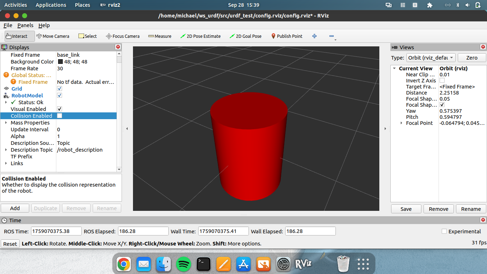

# ROS 2 Cylinder URDF 🚀

A minimal ROS 2 project with a cylinder URDF model, displayed in RViz2.

## Preview
Here’s how it looks in RViz2:



## Features
- Simple cylinder geometry with custom color
- Fixed joint to world frame
- Launch file with `robot_state_publisher` and RViz2

## Run It
```bash
git clone https://github.com/<your-username>/ros2-cylinder-urdf.git
cd ros2-cylinder-urdf
colcon build --symlink-install
source install/setup.bash
ros2 launch ros2-cylinder-urdf show_cylinder.launch.py
